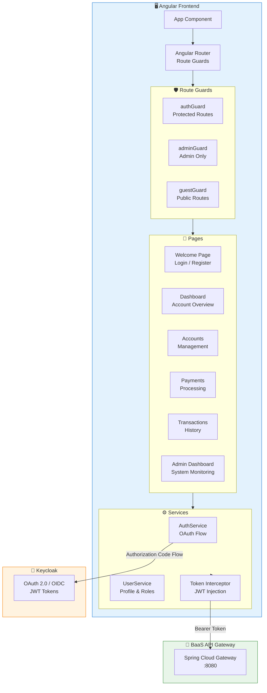

# BaaS Bank UI

**Modern Banking Frontend for the Banking as a Service Platform**


## Overview

A comprehensive banking frontend application built with **Angular 17** and **Bootstrap 5** that provides a complete banking interface for customers and administrators. Features role-based authentication via Keycloak, reactive forms, real-time account management, payment processing, transaction history, and a dedicated admin dashboard.

## Architecture



## Key Features

| Feature | Description |
|---------|-------------|
| **Role-Based Access** | BAAS_ADMIN and ACCOUNT_HOLDER roles with route guards |
| **OAuth 2.0 Authentication** | Keycloak integration with Authorization Code Flow |
| **Account Management** | View balances, account details, and status |
| **Payment Processing** | Initiate and track payments between accounts |
| **Transaction History** | View complete transaction history with filtering |
| **Admin Dashboard** | System-wide data aggregation and saga monitoring |
| **Responsive Design** | Mobile-friendly Bootstrap 5 layout |

## Tech Stack

- **Framework**: Angular 17 (Standalone Components)
- **UI Library**: Bootstrap 5.3.6
- **Language**: TypeScript 5.x
- **Authentication**: Keycloak OAuth 2.0 / OpenID Connect
- **HTTP Client**: Angular HttpClient with Interceptors
- **Testing**: Cypress E2E, Karma/Jasmine Unit Tests
- **Styling**: SCSS with Bootstrap variables

## Project Structure

```
baas-bank-ui/
├── src/app/
│   ├── app.component.ts              # Root component
│   ├── app.routes.ts                 # Route definitions
│   ├── app.config.ts                 # App configuration
│   ├── app.constants.ts              # Environment constants
│   ├── auth.service.ts               # Authentication service
│   ├── auth.guard.ts                 # Auth route guards
│   ├── admin.guard.ts                # Admin route guard
│   ├── welcome.component.ts          # Landing page
│   ├── auth-callback.component.ts    # OAuth callback handler
│   ├── dashboard/                    # User dashboard
│   ├── accounts/                     # Account management
│   ├── payments/                     # Payment processing
│   ├── transactions/                 # Transaction history
│   ├── admin/                        # Admin dashboard
│   └── shared/
│       ├── components/
│       │   └── navbar/               # Navigation component
│       ├── services/
│       │   └── user.service.ts       # User profile service
│       └── interceptors/
│           └── token.interceptor.ts  # JWT token injection
├── cypress/                          # E2E tests
└── angular.json                      # Angular configuration
```

## Quick Start

### Prerequisites
- Node.js 18+
- npm 9+
- Angular CLI 17
- Running BaaS Backend (port 8080)
- Keycloak Server (port 8089)

### Installation

```bash
# Clone the repository
git clone https://github.com/rajeswarandhandapani/baas-bank-ui.git
cd baas-bank-ui

# Install dependencies
npm install

# Start development server
npm start
```

The application will be available at `http://localhost:4200`

### Running Tests

```bash
# Unit tests
npm test

# E2E tests with Cypress
npm run cypress:open
```

## Authentication Flow

1. **User clicks Login/Register** → Redirects to Keycloak
2. **Keycloak authenticates** → Returns authorization code
3. **Auth Callback** → Exchanges code for JWT tokens
4. **Token Storage** → Stores access/refresh tokens in localStorage
5. **API Requests** → Token interceptor injects Bearer token
6. **Route Guards** → Protect routes based on authentication and roles

## Related Projects

- **Backend**: [Saga Orchestrated BaaS](https://github.com/rajeswarandhandapani/saga-orchestrated-banking-as-service)
- **Alternative Backend**: [Choreographed BaaS](https://github.com/rajeswarandhandapani/choreographed-banking-as-service)

## License

MIT

---

*Created by [Rajeswaran Dhandapani](https://rajeswarandhandapani.com)*
